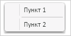

# Конструктор ShortSeparator

Конструктор ShortSeparator
-

# Конструктор ShortSeparator

## Синтаксис

PP.Ui.ShortSeparator(settings)

## Параметры

settings. JSON-объект со значениями
 свойств компонента.

## Описание

Конструктор ShortSeparator создает
 экземпляр класса [ShortSeparator](ShortSeparator.htm).

## Пример

Для выполнения примера необходимо наличие в теге <head> html-страницы
 ссылок на файл сценария PP.js и файл стилей PP.css, а сам пример нужно
 разместить в теге <script>. Создадим меню с двумя пунктами и разделителем
 между ними и отобразим его:

function createRoundButton() {
    // Создаем меню
    menu = new PP.Ui.Menu();
    // Создаем пункты меню
    var item1 = new PP.Ui.MenuItem({
        Content: "Пункт 1"
    });
    var item2 = new PP.Ui.MenuItem({
        Content: "Пункт 2"
    });
    // Создаем короткий разделитель
    var sep = new PP.Ui.ShortSeparator();
    // Добавляем пункты и разделитель между ними
    menu.addItem(item1);
    menu.addItem(sep);
    menu.addItem(item2);
    // Отображаем меню
    menu.show(20, 12);
}
В результате на страницу будет добавлено меню с двумя пунктами и коротким
 разделителем между ними:

См. также:

[ShortSeparator](ShortSeparator.htm)

		Справочная
		 система на версию 10.9
		 от 18/08/2025,
		 © ООО «ФОРСАЙТ»,
