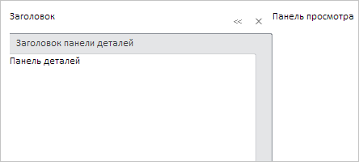

# SlidePanel.Resizing

SlidePanel.Resizing
-

# SlidePanel.Resizing

## Синтаксис

Resizing: function (sender, args);

## Параметры

sender. Источник события;

args. Информация
 о событии. Аргументы: startPosition
 - ширина панели до изменения размера.

## Описание

Событие Resizing наступает во
 время изменения размера панели Details.

## Пример

Для выполнения примера необходимо наличие в теге <head> html-страницы
 ссылок на файл сценария PP.js и файл стилей PP.css, в теге <body>
 html-страницы элемента 
 с идентификатором «panel», а сам пример
 нужно разместить в теге <script>. В событии onload тега <body>
 необходимо указать вызов функции createSlidePanel(). Создадим компонент
 [SlidePanel](../../Components/SlidePanel/SlidePanel.htm) и
 добавим обработчики событий [Resizing](SlidePanel.Resizing.htm)
 и [Resized](SlidePanel.Resized.htm):

function createSlidePanel() {
    // Создаем панель
    panel = new PP.Ui.SlidePanel({
        // Устанавливаем родительский элемент
        ParentNode: document.getElementById("panel"),
        // Заголовок панели
        HeaderContent: "Заголовок",
        // Заголовок панели деталей
        DetailsTitleContent: "Заголовок панели деталей",
        // Содержимое панели деталей
        DetailsContent: "Панель деталей",
        // Содержимое панели просмотра
        ViewContent: "Панель просмотра",
        // Ориентируем элемент управления по левой стороне
        Alignment: PP.Alignment.Left,
        // Устанавливаем высоту заголовка панели деталей
        DetailsTitleHeight: 25,
        // Устанавливаем признак изменения размера панели деталей
        EnableResize: true,
        // Устанавливаем минимальную ширину левой панели
        MinLeftPanelWidth: 50,
        // Устанавливаем обработчики событий изменения размера панели деталей
        Resizing: function (sender, args) {
            console.log("Изменяется размер панели деталей");
        },
        Resized: function (sender, args) {
            console.log("Изменился размер панели деталей");
        },
    });
}
В результате на страницу будет добавлен компонент [SlidePanel](../../Components/SlidePanel/SlidePanel.htm),
 ориентированный по левой стороне:

Получаем значение расстояния между содержимым панели Details
 и заголовком панели Details:

// Получаем значение расстояния между содержимым панели Details и заголовком панели Details
var width = panel.getConsoleCollapsedWidth();
console.log("Расстояние между содержимым панели Details и заголовком панели Details: " + width);

В результате в консоль будет выведено значение искомого расстояния:

Расстояние между содержимым панели Details и заголовком
 панели Details: 31

Изменяем размер панели деталей. В результате в консоль будет выведена
 информация об изменении размера панели деталей:

Изменяется размер панели деталей

Изменился размер панели деталей

См. также:

[SlidePanel](slidepanel.htm)

		Справочная
		 система на версию 10.9
		 от 18/08/2025,
		 © ООО «ФОРСАЙТ»,
