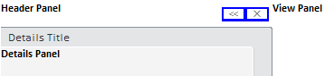

# SlidePanel.getButtonsPanelDomNode

SlidePanel.getButtonsPanelDomNode
-

# SlidePanel.getButtonsPanelDomNode

## Синтаксис

getButtonsPanelDomNode ()

## Описание

Метод getButtonsPanelDomNode возвращает DOM-вершину, в которой содержатся кнопки для закрытия и сворачивания/разворачивания консоли.

## Пример

Для выполнения примера создайте компонент [SlidePanel](../../Components/SlidePanel/SlidePanel.htm) с наименованием «slidePanel» (см. «[Пример создания компонента SlidePanel](../../Components/SlidePanel/Example_SlidePanel.htm)»). Изменим цвет фона DOM-вершины, в которой содержатся кнопки:

var buttons = slidePanel.getButtonsPanelDomNode()

buttons.style.backgroundColor = "Blue"

После выполнения примера кнопки компонента [SlidePanel](../../Components/SlidePanel/SlidePanel.htm) ,будут иметь синий фон:

См. также:

[SlidePanel](slidepanel.htm)

		Справочная
		 система на версию 10.9
		 от 18/08/2025,
		 © ООО «ФОРСАЙТ»,
