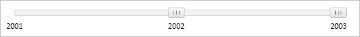

# Slider.AttachToTicks

Slider.AttachToTicks
-

**

# Slider.AttachToTicks

## Синтаксис

AttachToTicks: Boolean

## Описание

Свойство AttachToTicks** определяет признак привязки [бегунков](../SliderItem/SliderItem.htm) к меткам компонента [Slider](../../Components/Slider/Slider.htm).

## Комментарии

Значение свойства устанавливается из JSON и с помощью метода setAttachToTicks, а возвращается с помощью метода getAttachToTicks.

Если свойство имеет значение true, [бегунки](../SliderItem/SliderItem.htm) будут привязаны к меткам, иначе - не будут.

По умолчанию свойство имеет значение false.

## Пример

Для выполнения примера предполагается наличие на странице компонента [Slider](../../Components/Slider/Slider.htm) с наименованием «slider» (см. «[Пример создания компонента Slider](../../Components/Slider/Example_Slider.htm)» ). Установим привязку [бегунков](../SliderItem/SliderItem.htm) к меткам компонента [Slider](../../Components/Slider/Slider.htm):

// Установим привязку бегунков к меткам компонента
slider.setAttachToTicks(true);

В результате выполнения примера была установлена привязка [бегунков](../SliderItem/SliderItem.htm) к меткам компонента:

См. также:

[ Slider](slider.htm)

		Справочная
		 система на версию 10.9
		 от 18/08/2025,
		 © ООО «ФОРСАЙТ»,
