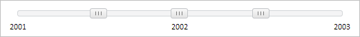

# Slider.CreateOnClick

Slider.CreateOnClick
-

# Slider.CreateOnClick

## Синтаксис

CreateOnClick: Boolean

## Описание

Свойство CreateOnClick определяет, будут ли создаваться новые [бегунки](../SliderItem/SliderItem.htm) при нажатии на компонент [Slider](../../Components/Slider/Slider.htm).

## Комментарии

Значение свойства устанавливается из JSON и с помощью метода setCreateOnClick, а возвращается с помощью метода getCreateOnClick.

Если свойство имеет значение true, новые [бегунки](../SliderItem/SliderItem.htm) будут создаваться при щелчке мыши, иначе - не будут.

По умолчанию свойство имеет значение false.

## Пример

Для выполнения примера предполагается наличие на странице компонента [Slider](../../Components/Slider/Slider.htm) с наименованием «slider» (см. «[Пример создания компонента Slider](../../Components/Slider/Example_Slider.htm)» ). Установим возможность создания новых [бегунков](../SliderItem/SliderItem.htm) при нажатии на компонент [Slider](../../Components/Slider/Slider.htm):

// Установим возможность создания новых бегунков при нажатии на компонент
slider.setCreateOnClick(true);

Щёлкнем по центру компонента.

В результате выполнения примера в центр компонента [Slider](../../Components/Slider/Slider.htm) был добавлен новый [бегунок](../SliderItem/SliderItem.htm):

См. также:

[ Slider](slider.htm)

		Справочная
		 система на версию 10.9
		 от 18/08/2025,
		 © ООО «ФОРСАЙТ»,
