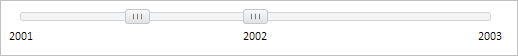

# Slider.ItemTickIndex

Slider.ItemTickIndex
-

**

# Slider.ItemTickIndex

## Синтаксис

ItemTickIndex: Number

## Описание

Свойство ItemTickIndex** определяет индекс метки, у которой находится [бегунок](../SliderItem/SliderItem.htm) компонента [Slider](../../Components/Slider/Slider.htm).

## Комментарии

Значение свойства устанавливается с помощью метода set**ItemTickIndex**, а возвращается с помощью метода get**ItemTickIndex**. Из JSON значение свойства задать нельзя.

При вызове метода set**ItemTickIndex** указываются три параметра: item - [бегунок](../SliderItem/SliderItem.htm), value - индекс метки, fireEvent - признак генерации события.

При вызове метода getItemActiveness указывается параметр item - [бегунок](../SliderItem/SliderItem.htm).

## Пример

Для выполнения примера предполагается наличие на странице компонента [Slider](../../Components/Slider/Slider.htm) с наименованием «slider» (см. «[Пример создания компонента Slider](../../Components/Slider/Example_Slider.htm)» ). Обработаем событие [ActiveItemChanged](Slider.ActiveItemChanged.htm), установим бегунок с индексом 1 в позицию метки с индексом 1 и сделаем активным бегунок с индексом 0:

// Обработаем событие ActiveItemChanged
slider.ActiveItemChanged.add(function (sender, args, timeout) {
    console.log("Инициировано событие ActiveItemChanged")
});
// Получим бегунок с индексом 1
var sliderItem = slider.getItems()[1];
// Установим бегунок в позицию метки с индексом 1
slider.setItemTickIndex(sliderItem, 1, true);
// Сделаем активным бегунок с индексом 0
slider.setLastActiveItem(slider.getItems()[0]);

В результате выполнения примера бегунок с индексом 1 был установлен в позицию метки с индексом 1:

Также в консоли браузера было выведено сообщение о вызове события [ActiveItemChanged](Slider.ActiveItemChanged.htm):

Инициировано событие ActiveItemChanged

См. также:

[ Slider](slider.htm)

		Справочная
		 система на версию 10.9
		 от 18/08/2025,
		 © ООО «ФОРСАЙТ»,
