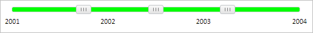

# Slider.addItem

Slider.addItem
-

**

# Slider.addItem

## Синтаксис

addItem(value: Number);

## Параметры

*value. Начальное значение [бегунка](../SliderItem/SliderItem.htm).*

## Описание

Метод addItem** добавляет новый [бегунок](../SliderItem/SliderItem.htm) на компонент [Slider](../../Components/Slider/Slider.htm).

## Пример

Для выполнения примера предполагается наличие на странице компонента [Slider](../../Components/Slider/Slider.htm) с наименованием «slider» (см. «[Пример создания компонента Slider](../../Components/Slider/Example_Slider.htm)» ). Заблокируем возможность обновления [компонента](../../Components/Slider/Slider.htm), добавим новый [бегунок](../SliderItem/SliderItem.htm) и метку, окрасим ось [компонента](../../Components/Slider/Slider.htm) зеленым цветом, разблокируем возможность обновления [компонента](../../Components/Slider/Slider.htm) и обновим его:

// Заблокируем возможность обновления компонента
slider.beginUpdate()
// Определим кисть
var brush = new PP.SolidColorBrush({
    Color: "#00ff00"
});
// Добавим новый бегунок со значением 0.5
slider.addItem(0.5);
// Добавим новую метку
slider.addTick(2004);
// Заполним ось компонента цветом указанной кисти
slider.fillAxis(brush);
// Разблокируем возможность обновления компонента и обновим его
slider.endUpdate()

В результате выполнения примера был добавлен новый [бегунок](../SliderItem/SliderItem.htm) и метка, ось [компонента](../../Components/Slider/Slider.htm) была окрашена зеленым цветом, [компонент](../../Components/Slider/Slider.htm) был обновлен:

См. также:

[ Slider](slider.htm)

		Справочная
		 система на версию 10.9
		 от 18/08/2025,
		 © ООО «ФОРСАЙТ»,
