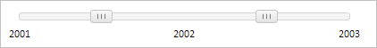

# Slider.update

Slider.update
-

**

# Slider.update

## Синтаксис

update();

## Описание

Метод update** обновляет компонент [Slider](../../Components/Slider/Slider.htm).

## Пример

Для выполнения примера предполагается наличие на странице компонента [Slider](../../Components/Slider/Slider.htm) с наименованием «slider» (см. «[Пример создания компонента Slider](../../Components/Slider/Example_Slider.htm)» ). Установим новое значение ширины компонента, обновим компонент:

// Установим новую ширину компонента
slider._Width = 400;
// Обновим компонент
slider.update();

В результате выполнения примера была изменена ширина компонента [Slider](../../Components/Slider/Slider.htm), компонент был обновлен:

См. также:

[ Slider](slider.htm)

		Справочная
		 система на версию 10.9
		 от 18/08/2025,
		 © ООО «ФОРСАЙТ»,
