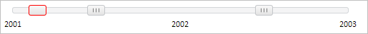

# SliderItem.IsStatic

SliderItem.IsStatic
-

**

# SliderItem.IsStatic

## Синтаксис

IsStatic: Boolean

## Описание

Свойство IsStatic** определяет возможность перемещения [бегунка](SliderItem.htm).

## Комментарии

Значение свойства устанавливается из JSON и с помощью метода set**IsStatic**, а возвращается с помощью метода get**IsStatic**.

Если свойство имеет значение false - [бегунок](SliderItem.htm) может перемещаться, иначе - не может.

По умолчанию свойство имеет значение false.

## Пример

Для выполнения примера предполагается наличие на странице компонента [Slider](../../Components/Slider/Slider.htm) с наименованием «slider» (см. «[Пример создания компонента Slider](../../Components/Slider/Example_Slider.htm)» ). Создадим новый [бегунок](SliderItem.htm) без возможности его перемещения вручную, определим и установим новую позицию для [бегунка](SliderItem.htm):

// Получим родительский контейнер бегунков компонента
var parentNode = slider.getItemByIndex(0).getParentNode();
// Создадим новый бегунок
var sliderItem = new PP.Ui.SliderItem({
    ParentNode: parentNode, // Родительский контейнер
    IsStatic: true, // Признак невозможности перемещения бегунка
    MaxValue: 1, // Максимально возможное значение бегунка
    MinValue: 0 // Минимально возможное значение бегунка
});
// Установим красные границы бегунка
var style = "width: 25px; height: 15px; border-color: red;";
sliderItem.setStyle(style);
// Определим новую позицию для бегунка
var position = {
    X: 50,
    Y: 7.5
}
// Установим новую позицию для бегунка
sliderItem.setPosition(position);

В результате выполнения примера был создан новый [бегунок](SliderItem.htm) без возможности его перемещения вручную с границами красного цвета, для него была установлена новая позиция:

См. также:

[ SliderItem](SliderItem.htm)

		Справочная
		 система на версию 10.9
		 от 18/08/2025,
		 © ООО «ФОРСАЙТ»,
