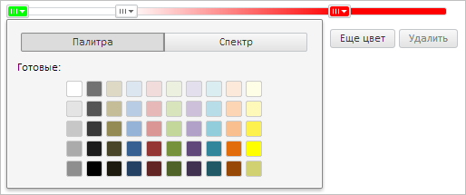

# SliderItemColor.Color

SliderItemColor.Color
-

**

# SliderItemColor.Color

## Синтаксис

Color: [PP.Color](dhtmlCommon.chm::/Classes/PP/Color/Color.htm)

## Описание

Свойство Color определяет
 цвет** [бегунка с возможностью выбора
 цвета](SliderItemColor.htm).

## Комментарии

Значение свойства устанавливается из JSON и с помощью метода set**Color**, а возвращается с помощью
 метода get**Color**.

## Пример

Для выполнения примера предполагается наличие на странице компонента
 [Slider](../../Components/Slider/Slider.htm) с наименованием
 «slider» (см. «[Пример
 создания компонента Slider](../../Components/Slider/Example_Slider.htm)» ). Создадим новый [бегунок
 с возможностью выбора цвета](SliderItemColor.htm), изменим его цвет, обработаем следующие
 события: [ColorChanged](SliderItemColor.ColorChanged.htm),
 [PaletteOpened](SliderItemColor.PaletteOpened.htm):

// Получим родительский контейнер бегунков компонента
var parentNode = slider.getItemByIndex(0).getParentNode();
// Создадим новый бегунок
var sliderItemColor = new PP.Ui.SliderItemColor({
    ParentNode: parentNode, // Родительский контейнер
    Color: "#000000" // Цвет бегунка
});
// Обработаем событие ColorChanged
sliderItemColor.ColorChanged.add(function (sender, args, timeout) {
    console.log("Инициировано событие ColorChanged")
});
// Обработаем событие PaletteOpened
sliderItemColor.PaletteOpened.add(function (sender, args, timeout) {
    console.log("Инициировано событие PaletteOpened")
});
// Установим новое значение цвета бегунка
sliderItemColor.setColor("#00FF00");

В результате выполнения примера был создан новый [бегунок
 с возможностью выбора цвета](SliderItemColor.htm), был изменен его цвет. Откроем меню выбора
 цвета, щёлкнув по добавленному [бегунку](SliderItemColor.htm):

Также в консоли браузера были выведены сообщения о вызове обработанных
 событий:

Инициировано событие ColorChanged

Инициировано событие PaletteOpened

См. также:

[ SliderItemColor](SliderItemColor.htm)

		Справочная
		 система на версию 10.9
		 от 18/08/2025,
		 © ООО «ФОРСАЙТ»,
