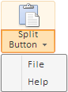

# Конструктор SplitButton

Конструктор SplitButton
-

# Конструктор SplitButton

## Синтаксис

PP.Ui.SplitButton (settings)

## Параметры

settings. JSON-объект со значениями свойств компонента.

## Описание

Конструктор SplitButton создает экземпляр класса [SplitButton](SplitButton.htm).

## Пример

Для выполнения примера добавьте ссылки на библиотеку PP.js и визуальные стили PP.css. В теге BODY добавьте элемент DIV с идентификатором «splitBut». В папке «PP_img» должна содержаться пиктограмма «paste.png». В теге SCRIPT добавим код для размещения компонента:

    var splitButton = new PP.Ui.SplitButton({
        ImageUrl: "../PP_img/paste.png",
        Content: "Split Button",
        UseWrapping: true,
        IsPressed: true,
        IsToggleButton: true,
        ParentNode: document.getElementById("splitBut"),
        Menu: {
            Items: [
            {
                MenuItem: { Content: "File", ResourceKey: "mainMenuBtn0" }
            },
            {
                MenuItem: { Content: "Help", ResourceKey: "mainMenuBtn4" }
            }
        ]
        }
    });

После выполнения примера на странице будет размещен компонент SplitButton, имеющий следующий вид:

Обе части кнопки отображаются в нажатом состоянии, поскольку для свойств [IsToggleButton](SplitButton.IsToggleButton.htm) и [IsPressed](SplitButton.IsPressed.htm) установлено значение true. Если для свойства IsToggleButton не установить значение true, то в нажатом состоянии будет отображаться только нижняя часть кнопки.

Поскольку для свойства [SplitButton.UseWrapping](SplitButton.UseWrapping.htm) установлено значение true, текст кнопки переносится по словам.

При нажатии на нижнюю часть кнопки раскрывается меню:

См. также:

[SplitButton](SplitButton.htm)

		Справочная
		 система на версию 10.9
		 от 18/08/2025,
		 © ООО «ФОРСАЙТ»,
