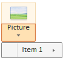

# Конструктор SplitMenuItem

Конструктор SplitMenuItem
-

# Конструктор SplitMenuItem

## Синтаксис

PP.Ui.SplitMenuItem(settings)

## Параметры

settings. JSON-объект со значением
 свойств экземпляра класса.

## Описание

Конструктор SplitMenuItem создает
 экземпляр класса SplitMenuItem.

## Пример

Для выполнения примера добавьте на HTML-страницу ссылки на файлы PP.css
 и PP.js. Предполагается наличие пиктограммы «picture.png» на одном уровне
 со страницей. В теге SCRIPT поместите код для размещения компонента [SplitButton](../SplitButton/SplitButton.htm) и добавления
 к компоненту пункта меню:

var splitBut = new PP.Ui.SplitButton({
      ParentNode: document.body,
      Content: "Picture",
      ImageUrl: "picture.png"
   });
menu = splitBut.getMenu();
menu.addItem(new PP.Ui.SplitMenuItem({
         Content: "Item 1"
      }));

После выполнения примера на страницу будет добавлена кнопка, состоящая
 из двух частей. При нажатии на нижнюю часть кнопки, будет вызвано меню,
 состоящее из одного пункта:

См. также:

[SplitMenuItem](SplitMenuItem.htm)

		Справочная
		 система на версию 10.9
		 от 18/08/2025,
		 © ООО «ФОРСАЙТ»,
