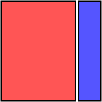

# Splitter.collapse

Splitter.collapse
-

# Splitter.collapse

## Синтаксис

collapse ()

## Описание

Метод collapse сворачивает левую или верхнюю панель компонента [Splitter](../../Components/Splitter/Splitter.htm).

## Комментарии

Если выбрано горизонтальное [расположение](Splitter.Orientation.htm) панелей, то сворачивается левая панель. Если вертикальное - верхняя.

Чтобы отобразить скрытую панель, используйте метод [Splitter.expand](Splitter.expand.htm).

## Пример

Для выполнения примера предполагается наличие на странице компонента [Splitter](../../Components/Splitter/Splitter.htm) с наименованием «splitter» (см. «[Пример создания компонента Splitter](../../Components/Splitter/Example_Splitter.htm)»). Добавим кнопки, при нажатии на которые будет скрываться и отображаться левая панель компонента:

var butCollapse = new PP.Ui.Button(
{
    ParentNode: document.getElementById("but1"),
    Click: function ()
    {
        splitter.collapse();
        alert(splitter.getCollapsed())
    },
    Content: "Свернуть"
})
var butExpand = new PP.Ui.Button(
{
    ParentNode: document.getElementById("but2"),
    Click: function ()
    {
        splitter.expand()
    },
    Content: "Развернуть"
})

После выполнения примера при нажатии на кнопку «Свернуть» левая панель будет свернута:

При этом на экран будет выведено сообщение с индексом свернутой панели.

При нажатии на кнопку «Развернуть» левая панель вернется в исходное положение:

См. также:

[Splitter](Splitter.htm)

		Справочная
		 система на версию 10.9
		 от 18/08/2025,
		 © ООО «ФОРСАЙТ»,
