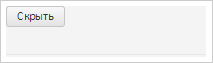

# Spoiler.Resized

Spoiler.Resized
-

# Spoiler.Resized

## Синтаксис

Resized: function(sender, args);

## Параметры

sender. Источник события;

args. Информация
 о событии. Аргументы: delta
 - величина, на которую изменился размер панели.

## Описание

Событие Resized наступает после
 изменения размера панели.

## Пример

Для выполнения примера предполагается наличие на странице компонента
 [Spoiler](../../Components/Spoiler/Spoiler.htm) c наименованием
 «spoiler» (см. «[Пример
 создания компонента Spoiler](../../Components/Spoiler/Example_Spoiler.htm)»). Добавим обработчики событий изменения
 размера панели:

// Устанавливаем обработчики событий изменения размера
spoiler.Resized.add(function (sender, args) {
    console.log("Изменен размер панели");
});
spoiler.Resizing.add(function (sender, args) {
    console.log("Меняется размер панели");
});
Уменьшим размер панели:

В результате в консоль будут выведены сообщения об изменении размера
 панели:

Меняется размер панели

Изменен размер панели

См. также:

[Spoiler](Spoiler.htm)

		Справочная
		 система на версию 10.9
		 от 18/08/2025,
		 © ООО «ФОРСАЙТ»,
