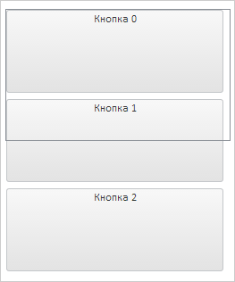

# StackPanel.DeferredResize

StackPanel.DeferredResize
-

# StackPanel.DeferredResize

## Синтаксис

DeferredResize: Boolean

## Описание

Свойство DeferredResize определяет
 признак изменения размера элементов после освобождения указателя мыши.

## Комментарии

Допустимые значения:

	- true.
	 Изменение размера элемента будет происходить после освобождения указателя
	 мыши;

	- false.
	 Изменение размера элемента будет происходить при перемещении указателя
	 мыши (по умолчанию).

Значение свойства устанавливается из JSON и с помощью метода setDeferredResize,
 а возвращается с помощью метода getDeferredResize.

## Пример

Для выполнения примера необходимо наличие на html-странице ссылок на
 файлы сценария PP.js и файл стилей PP.css, в теге <body> html-страницы
 элемента 
 с идентификатором «stackPanel», а сам пример нужно
 разместить в теге <script>. В событии onload тега <body> необходимо
 указать вызов функции createStackPanel(). Добавляем на страницу контейнер
 с элементами и реализуем обработчик события [ItemSizeChanging](StackPanel.ItemSizeChanging.htm):

var stackPanel;
function createStackPanel() {
    // Создаем контейнер
    stackPanel = new PP.Ui.StackPanel({
        // Учитывать размер полос прокрутки не будем
        AutoScrollSize: false,
        // Устанавливаем родительский элемент
        ParentNode: "stackPanel",
        // Устанавливаем размеры
        Width: 250,
        Height: 300,
        // Устанавливаем возможность изменения размера элементов контейнера
        IsContentResizable: true,
        // Устанавливаем признак изменения размера элемента после освобождения указателя мыши
        DeferredResize: true,
        // Разрешаем отображение полос прокрутки при необходимости
        ScrollVisible: true,
        ItemSizeChanging: function (sender, args) {
            console.log("Изменяется размер элемента контейнера")
        }
    });
    // Добавляем несколько кнопок
    for (var i = 0; i < 3; i++) {
        stackPanel.add(new PP.Ui.Button({ Content: "Кнопка "+ i }));
}
Получаем содержимое кнопки по координатам (20, 20):

// Получаем содержимое кнопки, находящейся по координатам (20, 20)
!!(stackPanel.getItemByPoint(20, 20)) ? console.log("Содержимое: " + stackPanel.getItemByPoint(20, 20).getContent().getContent()) : console.log("Элемент отсутствует");
В результате в консоль будет выведено содержимое кнопки или сообщение
 об отсутствии элемента:

Содержимое: Кнопка 1

Изменение размера кнопки с индексом 0 произойдёт не сразу, а только
 после освобождения указателя мыши. У данного элемента появится рамка нового
 размера:

Во время изменения размера элемента в консоли браузера будет выведено
 сообщение об изменении размера элемента.

См. также:

[StackPanel](StackPanel.htm)

		Справочная
		 система на версию 10.9
		 от 18/08/2025,
		 © ООО «ФОРСАЙТ»,
