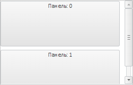

# StackPanel.IsContentResizable

StackPanel.IsContentResizable
-

# StackPanel.IsContentResizable

## Синтаксис

IsContentResizable: Boolean

## Описание

Свойство IsContentResizable
 определяет, доступно ли будет изменение размеров панелей компонента.

## Комментарии

По умолчанию установлено значение false,
 то есть изменять размеры панелей нельзя. Значение свойства задается только
 из конструктора.

Чтобы изменить размер панели, наведите на пространство между панелями
 - появится двойная стрелка, при помощи которой можно изменить высоту/ширину
 панелей (в зависимости от [ориентации](StackPanel.IsHorisontal.htm)):

При установке свойству значения true
 появляется полоса прокрутки.

## Пример

Для выполнения примера создайте компонент [StackPanel](../../Components/StackPanel/StackPanel.htm)
 с наименованием «stackPanel» и добавьте в него элементы (см. описание
 конструктора [StackPanel](Constructor_StackPanel.htm)). В конструкторе
 зададим значение для свойства IsContentResizable:

// Разрешаем изменять размеры панелей
IsContentResizable: true
Добавим обработчик события [ItemSizeChanged](StackPanel.ItemSizeChanged.htm):

stackPanel.ItemSizeChanged.add(function (sender, args) {
    console.log("height: " + args.Item.getHeight())
});
После выполнения примера можно будет изменять размеры панелей. При этом
 в консоль браузера будет выводиться высота панели, размеры которой изменились.

См. также:

[StackPanel](StackPanel.htm)

		Справочная
		 система на версию 10.9
		 от 18/08/2025,
		 © ООО «ФОРСАЙТ»,
