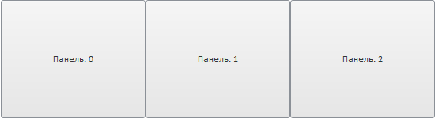

# StackPanel.IsHorisontal

StackPanel.IsHorisontal
-

# StackPanel.IsHorisontal

## Синтаксис

IsHorisontal: Boolean

## Описание

Свойство IsHorisontal определяет, будут компоненты размещаться горизонтально или вертикально.

## Комментарии

Если для свойства установлено значение true, компоненты располагаются горизонтально, иначе - вертикально. По умолчанию установлено значение false.

Горизонтально:

Вертикально (по умолчанию):

## Пример

Для выполнения примера создайте компонент [StackPanel](../../Components/StackPanel/StackPanel.htm) с наименованием «stackPanel» и добавьте в него элементы (см. описание конструктора [StackPanel](Constructor_StackPanel.htm)). Добавим кнопку, при нажатии на которую будет меняться положение панелей:

    var but1 = new PP.Ui.Button(
     {
         Content: "Поменять ориентацию",
         ParentNode: document.getElementById("but1"),
         Click: change
     })
     function change()
     {
         if (stackPanel.getIsHorisontal()) stackPanel.setIsHorisontal(false);
         else stackPanel.setIsHorisontal(true);
     }

После выполнения примера при нажатии на кнопку «Поменять ориентацию» будет изменяться положение панелей.

См. также:

[StackPanel](StackPanel.htm)

		Справочная
		 система на версию 10.9
		 от 18/08/2025,
		 © ООО «ФОРСАЙТ»,
