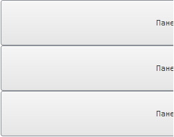
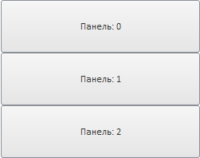

# StackPanel.beginUpdate

StackPanel.beginUpdate
-

# StackPanel.beginUpdate

## Синтаксис

beginUpdate ()

## Описание

Метод beginUpdate прекращает отрисовку компонента.

## Комментарии

При использовании метода beginUpdate последующие команды изменения параметров не будут вызывать немедленного обновления компонента. Чтобы изменения вступили в силу, используйте метод [StackPanel.endUpdate](StackPanel.endUpdate.htm).

## Пример

Для выполнения примера создайте компонент [StackPanel](../../Components/StackPanel/StackPanel.htm) с наименованием «stackPanel» и добавьте в него элементы (см. описание конструктора [StackPanel](Constructor_StackPanel.htm)). В теге BODY добавьте элементы DIVc идентификаторами «but1» и «but2». Добавим кнопки «begin update» и «end update»:

        var but1 = new PP.Ui.Button(
        {
            Content: "begin update",
            ParentNode: document.getElementById("but1"),
            Click: begin
        })
         var but2 = new PP.Ui.Button(
        {
            Content: "end update",
            ParentNode: document.getElementById("but2"),
            Click: end
        })
            function begin()
            {
                stackPanel.beginUpdate();
                stackPanel.setHeight(200);
                stackPanel.setWidth(250)
            }
            function end()
            {
                stackPanel.endUpdate();
            }

После выполнения примера при нажатии на кнопку «begin update» изменятся размеры компонента:

Далее нажмите на кнопку «end update» - компонент будет перерисован:

См. также:

[StackPanel](StackPanel.htm)

		Справочная
		 система на версию 10.9
		 от 18/08/2025,
		 © ООО «ФОРСАЙТ»,
