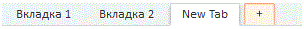

# TabControl.IsAddTabButtonVisible

TabControl.IsAddTabButtonVisible
-

# TabControl.IsAddTabButtonVisible

## Синтаксис

IsAddTabButtonVisible: Boolean;

## Описание

Свойство IsAddTabButtonVisible
 определяет признак отображения вкладки для добавления новых вкладок.

## Комментарии

Допустимые значения:

	- true. По умолчанию.
	 Вкладка для добавления новых вкладок отображается;

	- false. Вкладка для добавления
	 новых вкладок не отображается.

Вкладка для добавления содержит в заголовке знак «+». При нажатии на
 данную вкладку добавляется новая вкладка с заголовком «New Tab»:

Значение свойства задается из JSON при [создании
 компонента](Conctructor_TabControl.htm) или при помощи метода setIsAddTabButtonVisible(value,
 position). Значение возвращается при помощи метода getIsAddTabButtonVisible.

Параметры метода setIsAddTabButtonVisible:

value.
 Определяет, будет ли отображаться вкладка для добавления новых вкладок;

position.
 Позиция панели, на которой будет отображаться или скрываться вкладка для
 добавления новых вкладок. Элемент перечисления

## Пример

Для выполнения примера предполагается наличие на странице компонента
 [TabControl](../../Components/TabControl/TabControl.htm)
 с наименованием «tabcontrol» (см. «[Пример
 создания компонента TabControl](../../Components/TabControl/Example_TabControl.htm)»). Добавим кнопку, при нажатии на которую
 исчезнемт возможность Добавления новых вкладок:

var but1 = new PP.Ui.Button(

{

    ParentNode: document.body,

    Content: "Скрыть
 вкладку добавления",

    Click: function
 ()

    {

        tabcontrol.setIsAddTabButtonVisible
 (false);

    }

});

После выполнения примера на странице будет добавлена кнопка «Скрыть
 вкладку добавления», при нажатии на которую будет скрыта вкладка для добавления
 новых вкладок.

См. также:

[TabControl](TabControl.htm)

		Справочная
		 система на версию 10.9
		 от 18/08/2025,
		 © ООО «ФОРСАЙТ»,
