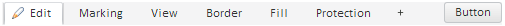

# TabControl.addButton

TabControl.addButton
-

# TabControl.addButton

## Синтаксис

addButton(value: JSON | PP.Ui.[Button](../Button/Button.htm)
 | PP.Ui.[TabControl](TabControl.htm), position: [PP.LTRB](dhtmlCommon.chm::/Enums/LTRB.htm),
 _isItem: Boolean, fireEvent: Boolean);

## Параметры

value.
 Элемент, который будет добавлен;

position. Позиция панели, в
 которую будет добавлен элемент;

_isItem. Признак добавления
 элемента в качестве вкладки;

fireEvent. Признак вызова события
 [TabControl.AddButton](TabControl.AddButton.htm)
 при выполнении метода.

## Описание

Метод addButton добавляет кнопку
 в компонент [TabControl](../../Components/TabControl/TabControl.htm).

## Пример

Для выполнения примера предполагается наличие на странице компонента
 [TabControl](../../Components/TabControl/TabControl.htm)
 с наименованием «tabcontrol» (см. «[Пример
 создания компонента TabControl](../../Components/TabControl/Example_TabControl.htm)»). Добавим кнопку в компонент TabControl:

tabcontrol1.AddButton.add(function (sender, args) {
    console.log("Добавлена кнопка с наименованием " + args.Button.getContent());
});
tabcontrol1.addButton({Content: "Button"}, "Top", false, true);

После выполнения примера в компонент TabControl
 будет добавлена кнопка и на экран будет выведено сообщение «Добавлена
 кнопка с наименованием Button»:

См. также:

[TabControl](TabControl.htm)

		Справочная
		 система на версию 10.9
		 от 18/08/2025,
		 © ООО «ФОРСАЙТ»,
