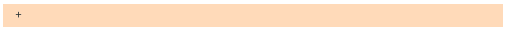

# TabControl.clear

TabControl.clear
-

# TabControl.clear

## Синтаксис

clear();

## Описание

Метод clear удаляет все вкладки
 компонента.

## Пример

Для выполнения примера предполагается наличие на странице компонента
 [TabControl](../../Components/TabControl/TabControl.htm)
 с наименованием «tabcontrol» (см. «[Пример
 создания компонента TabControl](../../Components/TabControl/Example_TabControl.htm)»). Добавим кнопку, при нажатии на которую
 будут удалены все вкладки компонента и будет изменен цвет панелей, на
 которых размещаются заголовки вкладок:

var but1 = new PP.Ui.Button(

{

    ParentNode: document.body,

    Content: "Clear",

    Click: function
 ()

    {

        tabcontrol.clear();

        tabcontrol.setBackground(new PP.[Color](dhtmlCommon.chm::/Classes/pp/color/color.htm)(255,
 218, 185))

    }

})

После выполнения примера при нажатии на кнопку «Clear»
 будут удалены все вкладки и изменится цвет панели, на которой они располагались:

См. также:

[TabControl](TabControl.htm)

		Справочная
		 система на версию 10.9
		 от 18/08/2025,
		 © ООО «ФОРСАЙТ»,
