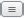
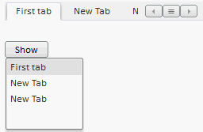

# TabControl.getItemsList

TabControl.getItemsList
-

# TabControl.getItemsList

## Синтаксис

getItemsList (position: [PP.LTRB](dhtmlCommon.chm::/enums/ltrb.htm));

## Параметры

position. Положение вкладок
 в компоненте - элемент перечисления [PP.LTRB](dhtmlCommon.chm::/enums/ltrb.htm).

## Описание

Метод getItemsList возвращает
 список вкладок из раскрывающейся панели компонента.

## Комментарии

Кнопка для вызова раскрывающейся панели появляется, когда места для
 размещения всех вкладок в компоненте становится недостаточно. Эта кнопка
 имеет следующий вид:

При нажатии на кнопку раскрывается панель, содержащая список заголовков
 вкладок. При нажатии на элемент списка, открывается соответствующая вкладка.

## Пример

Для выполнения примера подключите библиотеку компонентов PP.js и таблицы
 визуальных стилей PP.css. Создадим компонент [TabControl](../../Components/TabControl/TabControl.htm).
 Добавим кнопку, при нажатии на котрую раскрывается панель. Установим список
 вкладок в качестве содержимого панели.

//Создаем компонент TabControl:
    var tabcontrol = new PP.Ui.TabControl({
            //Идентификатор для тега div
            ParentNode: document.getElementById("tabcont1"),
            Width: 250,
            Height: 50,
            //Путь к папке с изображениями:
            ImagePath: "img"
        });
//Добавляем вкладку в компонент TabControl:
    tabcontrol.addItem(new PP.TabItem({ Position: PP.LTRB.Top, Caption: "First tab"}));
//Переменная, содержащая список вкладок из раскрывающейся панели компонента:
    var contForPan = tabcontrol.getItemsList(PP.LTRB.Top);
//Создаем раскрывающуюся панель:
    var droppanel = new PP.DropPanel({
            Width: 100,
            Height: 100,
            //Содержимое панели - список вкладок:
            Content: contForPan
        });
//Создаем кнопку вызова раскрывающейся панели:
    var button = new PP.Button({
            //Идентификатор для тега div
            ParentNode: document.getElementById("btn"),
            Content: "Show"
        });
    button.Click.add(function(sender, args) {
            droppanel.show();
        });

После выполнения примера на html-странице будет размещен компонент [TabControl](../../Components/TabControl/TabControl.htm)
 и [кнопка](../../Components/Button/Button.htm) с надписью «Show».
 При помощи вкладки со знаком «+» можно добавить новые вкладки. При нажатии
 на кнопку раскроется список заголовков вкладок. При нажатии на элементы
 списка будут раскрываться соответствующие вкладки.

Примечание.
 При нажатии на кнопку  раскроется пустая панель.

См. также:

[TabControl](TabControl.htm)

		Справочная
		 система на версию 10.9
		 от 18/08/2025,
		 © ООО «ФОРСАЙТ»,
