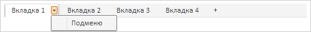
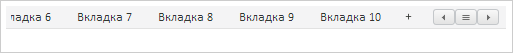
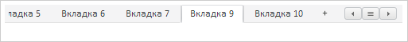
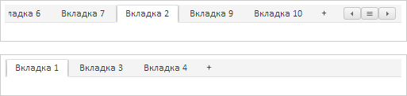
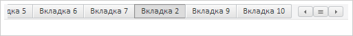
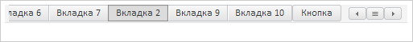

# TabControl.removeItemByIndex

TabControl.removeItemByIndex
-

# TabControl.removeItemByIndex

## Синтаксис

removeItemByIndex(value: Number, withDispose: Boolean);

## Параметры

value. Индекс вкладки, которую
 необходимо удалить;

withDispose. Признак полного
 уничтожения вкладки.

## Описание

Метод removeItemByIndex удаляет
 вкладку по индексу.

## Комментарии

Допустимые значения параметра withDispose:

	- true. Вкладка полностью
	 уничтожается;

	- false. Удаление вкладки
	 происходит без её уничтожения.

## Пример

Для выполнения примера необходимо наличие на html-странице ссылок на
 файлы сценария PP.js и файл стилей PP.css, в теге <body> html-страницы
 двух элементов 
 с идентификаторами tabControl1 и tabControl2.
 В событии onload тега <body> необходимо указать вызов функции createTabControl().
 Добавим на страницу два элемента управления и реализуем обработчики следующих
 событий у одного из них:

var tabControl1, tabControl2;
// Создаем элемент управления
function createTabControl() {
    tabControl1 = new PP.Ui.TabControl({
        // Устанавливаем родительский компонент
        ParentNode: document.getElementById("tabControl1"),
        // Устанавливаем путь к папке с картинками
        ImagePath: "../build/img/",
        // Устанавливаем размеры
        Width: 500,
        Height: 40,
        // Устанавливаем шаблон вкладок при добавлении в панель
        AddTabButtonTemplate: PP.Templates.TabItem,
        // Устанавливаем возможность вставки вкладок из других элементов управления
        EnableDropFromOutside: true,

        // Устанавливаем возможность выноса вкладки из элемента управления
        EnableDragOutside: true,
        // Устанавливаем автоматическое выравнивание содержимого
        ContentAutoFit: true,
        // Устанавливаем отступ слева
        PaddingLeft: 5,
        // Устанавливаем высоту панели вкладок
        HeaderHeight: 23,
        // Устанавливаем обработчик события вноса вкладки в элемент управления
        TabDragIn: function (sender, args) {
            console.log("Внесена вкладка из элемента управления с идентификатором: " + args.TabControl.getId())
        },
        // Устанавливаем обработчик события выноса вкладки из элемента управления
        TabDragOut: function (sender, args) {
            console.log("Вынесена вкладка за пределы элемента управления")
        },
    });
    // Создаем меню
    var menu = new PP.Ui.Menu({

        Items: [new PP.Ui.MenuItem({ Content: "Подменю" })]
    });
    tabControl2 = new PP.Ui.TabControl({
        // Устанавливаемп родительский компонент
        ParentNode: document.getElementById("tabControl2"),
        // Устанавливаем путь к папке с картинками
        ImagePath: "../build/img/",
        // Устанавливаем размеры
        Width: 500,
        Height: 40,
        // Устанавливаем массив вкладок
        Items: [{
                Caption: "Вкладка 1",
                Position: PP.LTRB.Top,

                // Устанавливаем меню 1 вкладке
                Menu: menu
            },
            {
                Caption: "Вкладка 2",
                Position: PP.LTRB.Top
            },
            {
                Caption: "Вкладка 3",
                Position: PP.LTRB.Top
            },
            {
                Caption: "Вкладка 4",
                Position: PP.LTRB.Top
            },

        ],
        // Устанавливаем обработчик события вноса вкладки в элемент управления
        TabDragIn: function (sender, args) {
            console.log("Внесена вкладка из элемента управления с идентификатором: " + args.TabControl.getId());
        },
        // Устанавливаем обработчик события выноса вкладки из элемента управления
        TabDragOut: function (sender, args) {
            console.log("Вынесена вкладка за пределы элемента управления");
        },
        // Устанавливаем обработчик события нажатия кнопки мыши на вкладке
        SelectableSelected: function (sender, args) {
            console.log("Произошло нажатие на вкладке с содержимым: " + args.Control.getCaption());
        },
        // Устанавливаем обработчик события вызова меню у вкладки
        TabMenuShowing: function (sender, args) {
            console.log("Вызвано меню у вкладки с содержимым: " + args.TabItem.getContent());
        }
    });
}

Добавляем вкладки в первый элемент управления:

// Добавляем элементы
tabControl1.beginUpdate();
for (var i = 1; i < 11; i++) {
    tabControl1.insertItem({ Caption: "Вкладка " + i }, i);
}
tabControl1.endUpdate();

Вызываем меню у первой вкладки второго элемента управления:

В результате в консоль будет выведено сообщение о вызове меню:

Вызвано меню у вкладки с содержимым: Вкладка 1

Нажимаем кнопкой мыши на вторую вкладку второго элемента управления.
 В результате в консоль будет выведен результат нажатия:

Произошло нажатие на вкладке с содержимым: Вкладка
 2

Прокручиваем панель вкладок до девятой вкладки:

// Прокручиваем панель вкладок до девятой вкладки
tabControl1.scrollToItem(tabControl1.getItems()[8]);

В результате панель вкладок первого элемента управления будет прокручена
 до девятой вкладки:

Устанавливаем выделение на девятую вкладку:

// Устанавливаем выделение на девятую вкладку
tabControl1.setSelectedIndex(8);

В результате будет выделена девятая вкладка:

Удаляем восьмую вкладку:

// Удаляем восьмую вкладку:
tabControl1.removeItemByIndex(7);

В результате из панели вкладок будет удалена восьмая вкладка:

Перенесем из второго элемента управления вторую вкладку и вставим ее
 перед девятой вкладкой первого элемента управления. В результате вторая
 вкладка будет перед девятой вкладкой первого элемента управления:

 

В консоль будет выведена информация о событиях, возникающих при переносе
 вкладок:

Вынесена вкладка за пределы элемента управления

Внесена вкладка из элемента управления с идентификатором:
 "TabControl783"

Устанавливаем стиль вкладок, как у панели инструментов, и получаем содержимое
 кнопки первой вкладки:

// Устанавливаем стиль вкладок, как у панели инструментов
tabControl1.setUseToolBarSwitch(true);
// Получаем содержимое кнопки первой вкладки
console.log("Содержимое кнопки первой вкладки: " + tabControl1.getToolBarButtonByTabItem(tabControl.getItems()[0]));

В результате панель вкладок будет иметь вид панели инструментов:

В консоль будет выведено содержимое кнопки первой вкладки:

Содержимое кнопки первой вкладки: Вкладка 1

Вставляем новую кнопку в элемент управления и получаем ее содержимое:

// Вставляем новую кнопку в элемент управления
tabControl1.insertButton(new PP.Ui.Button({ Content: "Кнопка" }), "Top");
// Получаем содержимое добавленной кнопки
console.log("Содержимое добавленной кнопки: " + tabControl1.getButtons().Top[0].getContent());

В результате в элемент управления будет добавлена кнопка:

 

В консоль будет выведено содержимое добавленной кнопки:

Содержимое добавленной кнопки: Кнопка

Получаем количество видимых вкладок верхней панели:

// Получаем количество видимых вкладок верхней панели
console.log("Количество видимых вкладок верхней панели: " + tabControl1.getVisibleItems().length);

В результате в консоль будет выведено количество вкладок верхней панели:

Количество видимых вкладок верхней панели: 10

См.
 также:

[TabControl](TabControl.htm)

		Справочная
		 система на версию 10.9
		 от 18/08/2025,
		 © ООО «ФОРСАЙТ»,
