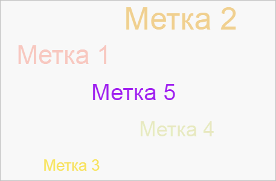
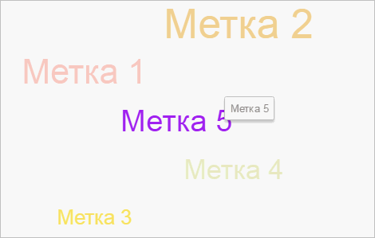

# TagCloud.addItem

TagCloud.addItem
-

# TagCloud.addItem

## Синтаксис

addItem(value: String || Number || PP.Ui.[TagCloudItem](../TagCloudItem/TagCloudItem.htm),
 sourceName: String, series: Object);

## Параметры

value. Добавляемый элемент;

sourceName. Наименование источника
 данных. Если не указан, то будет помещен в первый список;

series. Идентификатор и серия
 данных для источника.

## Описание

Метод addItem добавляет новый
 элемент в облако меток.

## Пример

Для выполнения примера предполагается наличие на странице компонента
 [TagCloud](../../Components/TagCloud/TagCloud.htm) c наименованием
 «tagCloud» (см. «[Пример
 создания компонента TagCloud](../../Components/TagCloud/Example_TagCloud.htm)»). Пример нужно разместить в теге <script>.
 Создаем новую метку и устанавливаем ей параметры, добавляем к облаку меток
 обработчики следующих событий: [ItemMouseOut](TagCloud.ItemMouseOut.htm),
 [ItemMouseOver](TagCloud.ItemMouseOver.htm):

// Добавляем обработчик события выхода курсора за пределы области активной метки
tagCloud.ItemMouseOut.add(function (sender, args) { console.log("Курсор вышел за область метки") }, tagCloud);
// Добавляем обработчик события наведения курсора на метку
tagCloud.ItemMouseOver.add(function (sender, args) { console.log("Курсор наведен на метку") }, tagCloud);
// Параметры для новой метки
var paramTag = {
    Tag5: {
        color: {
            Items: [50.0]
        },
        size: {
            Items: [45]
        }
    }
}// Создаем новую метку
tag = new PP.Ui.TagCloudItem({
    // Устанавливаем признак активности метки
    Active: true,
    // Устанавливаем заголовок метки
    Caption: "Метка 5",
    // Устанавливаем признак отображения метки
    IsPlaced: true
});
// Добавляем метку в облако
tagCloud.addItem(tag, null, paramTag);
// Получаем метку из облака
tag = tagCloud.getItems()[4];
// Устанавливаем новый цвет метке
tag.setColor("#A020F0");
// Устанавливаем новый размер
tag.setSize(60);
// Меняем форму разброса элементов на сферическую
tagCloud.setShape("Sphere");
В результате в облако будет добавлена еще одна метка с новыми параметрами:

Устанавливаем признак остановки анимации при наведении курсора на активную
 метку:

// Устанавливаем признак остановки анимации при наведении курсора на активную метку
tagCloud.setFreezeActive(true);
При наведение курсора мыши на активную метку анимация движения меток
 будет остановлена. У активной метки появится всплывающая подсказка:

В консоль будет выведено сообщение о наведение курсора мыши на метку:

Курсор наведен на метку

Получаем значение прозрачности активной метки:

// Получаем активную метку
var activeTag = tagCloud.getActiveItem();
// Получаем значение прозрачности активной метки
console.log("Значение прозрачности активной метки: " + activeTag.getOpacity());
В результате в консоль будет выведено значение прозрачности активной
 метки:

Значение прозрачности активной метки: 1

После выхода курсора за пределы области активной метки в консоль будет
 выведено сообщение:

Курсор вышел за область метки

См. также:

[TagCloud](TagCloud.htm)

		Справочная
		 система на версию 10.9
		 от 18/08/2025,
		 © ООО «ФОРСАЙТ»,
