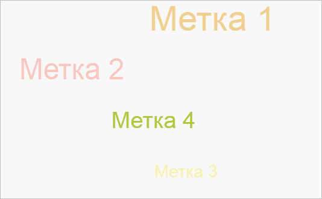

# TagCloudItem.animationStep

TagCloudItem.animationStep
-

# TagCloudItem.animationStep

## Синтаксис

animationStep(part: Number, paper: Object, xoff:
 Number, yoff: Number);

## Параметры

part. Шаг анимации;

paper. Область отрисовки элемента;

xoff. Значение координаты X
 центра;

yoff. Значение координаты Y
 центра.

## Описание

Метод animationStep просчитывает
 позицию элемента облака меток на заданное число шагов анимации.

## Пример

Для выполнения примера предполагается наличие на странице компонента
 [TagCloud](../../Components/TagCloud/TagCloud.htm) c наименованием
 «tagCloud» (см. «[Пример
 создания компонента TagCloud](../../Components/TagCloud/Example_TagCloud.htm)»). Пример нужно разместить в теге <script>.
 Изменим целевую позицию первого элемента облака меток и просчитаем его
 позицию после первого шага анимации:

// Устанавливаем новые целевые координаты первому элементу
tagCloud.getItems()[0].setTargetPosition({ X: 100, Y: -80 });
// Делаем шаг анимации у 1 элемента
tagCloud.getItems()[0].animationStep(1, document.getElementsByTagName("canvas")[0].getContext("2d"));
// Перерисовываем облако меток
tagCloud.draw();
Положение элементов до перерисовки:

Положение элементов после перерисовки:

В результате первый элемент будет сдвинут к целевой позиции.

См. также:

[TagCloud](../TagCloud/TagCloud.htm)

		Справочная
		 система на версию 10.9
		 от 18/08/2025,
		 © ООО «ФОРСАЙТ»,
