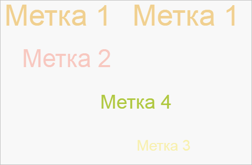

# TagCloudItem.draw

TagCloudItem.draw
-

# TagCloudItem.draw

## Синтаксис

draw(context: Object, xoff: Number, yoff: Number);

## Параметры

context. Область отрисовки
 элемента;

xoff. Величина сдвига по горизонтали;

yoff. Величина сдвига по вертикали.

## Описание

Метод draw рисует элемент облака
 меток.

## Пример

Для выполнения примера предполагается наличие на странице компонента
 [TagCloud](../../Components/TagCloud/TagCloud.htm) c наименованием
 «tagCloud» (см. «[Пример
 создания компонента TagCloud](../../Components/TagCloud/Example_TagCloud.htm)»). Пример нужно разместить в теге <script>.
 Отрисуем первый элемент облака со сдвигом (0, 150):

//Получаем размеры области отрисовки
console.log("Высота области отрисовки: " + tagCloud.getCanvas().getHeight());
console.log("Ширина области отрисовки: " + tagCloud.getCanvas().getWidth());
// Получаем координаты 1 элемента:
console.log("Координата X первого элемента: " + tagCloud.getItems()[0].getPosition().getX());
console.log("Координата Y первого элемента: " + tagCloud.getItems()[0].getPosition().getY());
console.log("Координата Z первого элемента: " + tagCloud.getItems()[0].getPosition().getZ());
// Получаем область отрисовки
var canvas = document.getElementsByTagName("canvas")[0];
// Рисуем первый элемент в новых координатах:
tagCloud.getItems()[0].draw(canvas.getContext("2d"), 0, 150);
В консоль будет выведены высота и ширина области отрисовки и координаты
 первого элемента:

Высота области отрисовки: 300

Ширина области отрисовки: 500

Координата X первого элемента: 107.34501265351119

Координата Y первого элемента: -61.617024988038025

Координата Z первого элемента: -43.66867286785989

В результате первый элемент будет отрисован в новых координатах:

См. также:

[TagCloud](../TagCloud/TagCloud.htm)

		Справочная
		 система на версию 10.9
		 от 18/08/2025,
		 © ООО «ФОРСАЙТ»,
