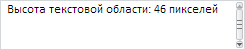

# TextArea.getContentNode

TextArea.getContentNode
-

# TextArea.getContentNode

## Синтаксис

getContentNode();

## Описание

Метод getContentNode возвращает
 DOM-вершину содержимого [текстовой области](TextArea.htm).

## Комментарии

Возвращаемое значение - HTMLElement.

## Пример

Для выполнения примера необходимо наличие на html-странице ссылок на
 файл сценария PP.js и файл стилей PP.css, в теге <body> html-страницы
 элемента 
 с идентификатором «textArea». В событии onload тега
 <body> необходимо указать вызов функции createTextArea(). Создадим
 текстовую область и реализуем обработчик события [ValueChanged](TextArea.ValueChanged.htm):

function createTextArea() {
    // Создаем текстовую область
    textArea = new PP.Ui.TextArea({
        // Устанавливаем родительский элемент
        ParentNode: document.getElementById("textArea"),
        // Устанавливаем содержимое текстовой поля
        Content: "",
        // Устанавливаем высоту и ширину текстовой области
        Height: 50,
        Width: 245,
        // Устанавливаем признак доступности выделения текста
        TextSelectable: true,
        // Устанавливаем обработчик события изменения значения текстовой области
        ValueChanged: function (sender, args) {
            console.log("Изменилось значение текстовой области");
        }
    });
    // Добавляем информацию о высоте компонента в текстовую область
    textArea.setContent("Высота текстовой области: " + textArea.getContentNode().clientHeight + " пикселей");
}
В результате в текстовой области будет находиться информация о высоте
 текстовой области:

Также в консоль будет выведено сообщение об изменении значения текстовой
 области:

Изменилось значение текстовой области

Будет доступно выделение текста, так как для свойства [TextSelectable](TextArea.TextSelectable.htm)
 установлено значение true.

См. также:

[TextArea](TextArea.htm)

		Справочная
		 система на версию 10.9
		 от 18/08/2025,
		 © ООО «ФОРСАЙТ»,
