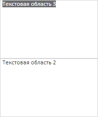

# TextArea.getFormattedText

TextArea.getFormattedText
-

**

# TextArea.getFormattedText

## Синтаксис

getFormattedText();

## Описание

Метод getFormattedText**
 возвращает форматированный текст компонента.

## Комментарии

Метод возвращает значение типа String.

## Пример

Для выполнения примера предполагается наличие на странице компонентов
 [TextArea](../../Components/TextArea/TextArea.htm) с наименованиями
 «textArea1» и «textArea2» (см. «[Пример
 создания компонента TextArea](../../Components/TextArea/TextArea_Example.htm)»). Добавим обработчики событий [TextChanged](TextArea.TextChanged.htm),
 [Blur](TextArea.Blur.htm), [Focus](TextArea.Focus.htm).
 Затем получим старый и зададим новый текст содержимого компонента с наименованием
 «textArea1», а также поочередно установим фокус на оба компонента. Выделим
 содержимое компонента с наименованием «textArea1»:

// Обработаем событие TextChanged
textArea1.TextChanged.add(function (sender, eventArgs) {
    console.log("Новое содержимое textArea1: " + eventArgs.Value);
});
// Обработаем событие Blur
textArea1.Blur.add(function (sender, eventArgs) {
    console.log("Инициировано событие Blur");
});
// Обработаем событие Focus
textArea1.Focus.add(function (sender, eventArgs) {
    console.log("Инициировано событие Focus");
});
// Отобразим текст содержимого компонента «textArea1»
console.log("Старое содержимое textArea1: " + textArea1.getFormattedText());
// Установим фокус на компонент textArea1
textArea1.setFocus();
// Изменим содержимое текстовой области
textArea1.setContent("Текстовая область 3");
// Установим фокус на компонент textArea2
textArea2.setFocus();
// Выделим все содержимое компонента textArea1
textArea1.selectAll();

В результате выполнения примера компонент с наименованием «textArea1»
 стал содержать текст «Текстовая область 3», было выделено его содержимое:

В консоли браузера были выведены сообщения о инициации событий, а
 также текст старого и нового содержимого компонента с наименованием «textArea1»:

Старое содержимое textArea1: Текстовая область 1

Инициировано событие Focus

Инициировано событие Blur

Новое содержимое textArea1: Текстовая область 3

См. также:

[TextArea](TextArea.htm)

		Справочная
		 система на версию 10.9
		 от 18/08/2025,
		 © ООО «ФОРСАЙТ»,
