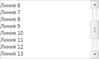

# TextArea.scrollTo

TextArea.scrollTo
-

**

# TextArea.scrollTo

## Синтаксис

scrollTo(positionV: Number, positionH: Nubmer, isPercent:Boolean, fireEvent: Boolean);

## Параметры

positionV. Позиция вертикальной полосы прокрутки;

*positionH. Позиция горизонтальной полосы прокрутки;*

*isPercent.* Флаг использования процентного задания позиции.

*fireEvent.* Флаг инициации события.

## Описание

Метод scrollTo** устанавливает позицию прокрутки.

## Пример

Для выполнения примера предполагается наличие на странице компонента [TextArea](../../Components/TextArea/TextArea.htm) с наименованием «textArea1» (см. «[Пример создания компонента TextArea](../../Components/TextArea/TextArea_Example.htm)» ). Выполним вертикальную прокрутку на позицию, равную 50% полосы прокрутки:

// Сформируем текстовое содержимое
var text;
for (var i = 0; i < 20; i++) {
    text += "Линия " + i + " ";
};
// Изменим текстовое содержимое компонента
textArea1.setContent(text);
// Выполним вертикальную прокрутку на позицию, равную 50% полосы прокрутки
textArea1.scrollTo(50, 0, true, true);

В результате выполнения примера была выполнена вертикальная прокрутка:

См. также:

[TextArea](TextArea.htm)

		Справочная
		 система на версию 10.9
		 от 18/08/2025,
		 © ООО «ФОРСАЙТ»,
