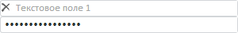

# TextBox.Blur

TextBox.Blur
-

**

# TextBox.Blur

## Синтаксис

Blur: function(sender, args, timeout);

## Параметры

sender. Источник события;

args. Информация о событии;

timeout. Промежуток времени
 в миллисекундах, через который вызовется событие.

## Описание

Событие Blur** наступает
 при потере фокуса [текстовым полем](TextBox.htm).

## Пример

Для выполнения примера предполагается наличие на странице компонента
 [TextBox](../../Components/TextBox/TextBox.htm) с наименованием
 «textBox» (см. «[Пример
 создания компонента TextBox](../../Components/TextBox/TextBox_Example.htm)» ). Создадим второе текстовое поле со
 скрытым текстом, обработаем следующие события: [Blur](textBox.Blur_E.htm),
 [Focus](textBox.Focus.htm), [ValueChanged](TextBox.ValueChanged.htm),
 установим фокус [текстового поля](TextBox.htm):

// Устанавливаем прозрачный текст первого текстового поля
textBox.setWatermarkText("Текстовое поле 1");
// Создаем второе текстовое поле
var textBox2 = new PP.Ui.TextBox({
    ParentNode: "TL", // Идентификатор родительского контейнера
    EnableEdit: true, // Возможность редактирования
    MaxLength: 24, // Максимальная длина текста в компоненте
    IsPassword: true // Признак скрытия текста
});
// Устанавливаем текст второму текстовому полю
textBox2.setContent("Текстовое поле 2");
// Устанавливаем обработчик события снятия фокуса
textBox.Blur.add(function (sender, args, timeout) {
    console.log("Инициировано событие Blur")
});
// Устанавливаем обработчик события установки фокуса
textBox2.Focus.add(function (sender, args, timeout) {
    console.log("Инициировано событие Focus")
});
// Устанавливаем фокус в первое текстовое поле
textBox.setFocus();
// Снимаем фокус у первого текстового поля
textBox.blur();
// Устанавливаем фокус во второе текстовое поле
textBox2.setFocus();

В результате выполнения примера было создано второе [текстовое
 поле](TextBox.htm) со скрытым текстом:

Также в консоли браузера были выведены сообщения о вызове обработанных
 событий:

Инициировано событие Blur

Инициировано событие Focus

[TextBox](TextBox.htm)

		Справочная
		 система на версию 10.9
		 от 18/08/2025,
		 © ООО «ФОРСАЙТ»,
