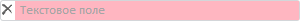

# TextBox.ValidState

TextBox.ValidState
-

**

# TextBox.ValidState

## Синтаксис

ValidState: Boolean

## Описание

Свойство ValidState** определяет
 состояние [текстового поля](TextBox.htm) как корректно или
 некорректно заполненное, устанавливая соответствующую подсветку.

## Комментарии

Значение свойства устанавливается с помощью метода set**ValidState**,
 а возвращается с помощью метода get**ValidState**.
 Из JSON значение свойства установить нельзя.

Если для свойства установлено значение true,
 [текстовое поле](TextBox.htm) подсвечено как корректное заполненное,
 иначе - как некорректно заполненное.

По умолчанию установлено значение true.

## Пример

Для выполнения примера предполагается наличие на странице компонента
 [TextBox](../../Components/TextBox/TextBox.htm) с наименованием
 «textBox» (см. «[Пример
 создания компонента TextBox](../../Components/TextBox/TextBox_Example.htm)» ). Установим подсветку [текстового
 поля](TextBox.htm) как некорректно заполненного, получим и выведем значения высоты,
 ширины и отступов фоновой картинки:

// Установим подсветку некорректно введенного значения
textBox.setValidState(false);
// Получим значение высоты фоновой картинки
console.log("Высота фоновой картинки: " + textBox.getImageHeight());
// Получим значение отступов фоновой картинки
console.log("Отступы фоновой картинки: " + textBox.getImageMargin());
// Получим значение ширины фоновой картинки
console.log("Ширина фоновой картинки: " + textBox.getImageWidth());

В результате выполнения примера [текстовое поле](TextBox.htm)
 было подсвечено как некорректное заполненное:

Также в консоли браузера были выведены значения высоты, ширины и отступов
 фоновой картинки [текстового поля](TextBox.htm):

Высота фоновой картинки: 16

Отступы фоновой картинки: 2

Ширина фоновой картинки: 10

См. также:

[TextBox](TextBox.htm)

		Справочная
		 система на версию 10.9
		 от 18/08/2025,
		 © ООО «ФОРСАЙТ»,
