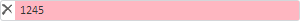

# TextBox.applyValidCSS

TextBox.applyValidCSS
-

**

# TextBox.applyValidCSS

## Синтаксис

applyValidCSS();

## Описание

Метод applyValidCSS** устанавливает
 стиль, определяющий подсветку корректно введенного значения [текстового
 поля](TextBox.htm).

## Пример

Для выполнения примера предполагается наличие на странице компонента
 [TextBox](../../Components/TextBox/TextBox.htm) с наименованием
 «textBox» (см. «[Пример
 создания компонента TextBox](../../Components/TextBox/TextBox_Example.htm)» ). Разрешим редактирование текстового
 поля, установим подсветку некорректно введенного значения и определим
 разрешённые к вводу символы:

// Разрешим редактирование текстового поля
textBox.setEnableEdit(true);
// Применим подсветку некорректно введенного значения
textBox.applyNotValidCSS();
// Установим разрешенные символы текстового поля
textBox.setAllowedSymbols(['1', '2', '4', '5']);

Далее вручную введём в [текстовое поле](TextBox.htm) следующий
 текст: «12345».

В результате [текстовое поле](TextBox.htm) будет иметь подсветку
 некорректно введенного значения, а также содержать следующий текст: «1245»:

Применим подсветку корректно введенного значения и установим запрещенные
 к вводу символы:

// Очистим текстовое поле
textBox.setContent("");
// Применим подсветку корректно введенного значения
textBox.applyValidCSS();
// Установим запрещенные символы текстового поля
textBox.setRestrictedSymbols(['3', '4']);
Вручную введем в [текстовое поле](TextBox.htm) следующий
 текст: «12345».

В результате [текстовое поле](TextBox.htm) будет иметь подсветку
 корректно введенного значения, а так же содержать следующий текст: «125»:

См. также:

[TextBox](TextBox.htm)

		Справочная
		 система на версию 10.9
		 от 18/08/2025,
		 © ООО «ФОРСАЙТ»,
