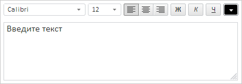

# Конструктор TextEditor

Конструктор TextEditor
-

# Конструктор TextEditor

## Синтаксис

TextEditor(settings);

## Параметры

settings. JSON-объект со значениями
 свойств компонента.

## Описание

Конструктор TextEditor создает
 экземпляр компонента [TextEditor](../../Components/TextEditor/TextEditor.htm).

## Пример

Для выполнения примера необходимо наличие на html-странице ссылок на
 файлы PP.js, resources.ru.js и файл стилей PP.css. В теге <body>
 разместим блок с идентификатором «textEditorContainer» для хранения созданного
 компонента:

Далее в теге <body> необходимо добавить сценарий, создающий текстовый
 редактор:

После выполнения примера на странице будет размещен компонент [TextEditor](../../Components/TextEditor/TextEditor.htm),
 имеющий следующий вид:

См. также:

[TextEditor](TextEditor.htm)

		Справочная
		 система на версию 10.9
		 от 18/08/2025,
		 © ООО «ФОРСАЙТ»,
