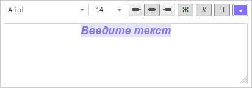

# TextEditor.PropertyChanged

TextEditor.PropertyChanged
-

# TextEditor.PropertyChanged

## Синтаксис

PropertyChanged: function(sender, args, timeout);

## Параметры

sender. Источник события;

args. Информация о событии. Доступные аргументы: PropertyName - возвращает название свойства, значение которого было изменено, элемент перечисления [FontBox.PropertyName](../../Enums/FontBox.PropertyName.htm); Value - новое значение свойства;

timeout. Промежуток времени в миллисекундах, через который вызовется событие.

## Описание

Событие PropertyChanged наступает при изменении настроек [текстового редактора](TextEditor.htm).

## Пример

Для выполнения примера предполагается наличие на странице компонента [TextEditor](../../Components/TextEditor/TextEditor.htm) с наименованием «textEditor» (см. описание [конструктора TextEditor](Constructor_TextEditor.htm)). Обработаем событие [PropertyChanged](TextEditor.PropertyChanged.htm) так, чтобы при изменении значений свойств компонента в консоль браузера выводились их новые значения. Выделим весь текст, установим для него полужирное и курсивное начертание, установим подчеркивание текста. Выровняем текст по центру, установим новый цвет фона, цвет шрифта, семейство шрифтов и размер шрифта:

// Обработаем событие изменения настроек компонента
textEditor.PropertyChanged.add(function (sender, args) {
    console.log("Свойство: " + args.PropertyName + "; Значение: " + args.Value)
});
// Выделим весь текст в текстовой области для дальнейшего применения настроек к нему
textEditor.selectAll();
// Установим полужирное начертание для выделенного текста
textEditor.setIsBold(true);
// Установим курсивное начертание для выделенного текста
textEditor.setIsItalic(true);
// Установим подчеркивание для выделенного текста
textEditor.setIsUnderline(true);
// Установим выравнивание по центру
textEditor.setAlignment(PP.HorizontalAlignment.Center);
// Установим цвет фона
textEditor.setBackgroundColor("#E6E6FA");
// Установим цвет шрифта
textEditor.setFontColor("#8470FF");
// Установим семейство шрифтов
textEditor.setFontFamily(PP.Font.Family.Arial);
// Установим размер шрифта
textEditor.setFontSize(14);

В результате выполнения примера были изменены настройки текстового редактора. После снятия выделения с текста компонент [TextEditor](../../Components/TextEditor/TextEditor.htm) будет иметь следующий вид:

Также в консоли браузера были выведены новые значения всех измененных свойств текстового редактора:

Свойство: IsBold; Значение: true

Свойство: IsItalic; Значение: true

Свойство: IsUnderline; Значение: true

Свойство: Alignment; Значение: Center

Свойство: BackgroundColor; Значение: #E6E6FA

Свойство: Color; Значение: #8470FF

Свойство: FontFamily; Значение: Arial

Свойство: Size; Значение: 14

См. также:

[TextEditor](TextEditor.htm)

		Справочная
		 система на версию 10.9
		 от 18/08/2025,
		 © ООО «ФОРСАЙТ»,
