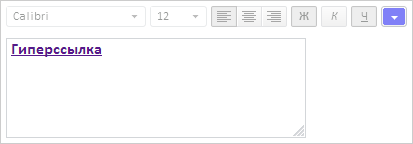
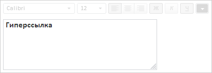

# TextEditor.getFontBox

TextEditor.getFontBox
-

# TextEditor.getFontBox

## Синтаксис

getFontBox();

## Описание

Метод getFontBox возвращает элемент управления, предназначенный для настроек параметров текста.

## Комментарии

Метод возвращает объект типа [FontBox](../FontBox/FontBox.htm).

## Пример

Для выполнения примера предполагается наличие на странице компонента [TextEditor](../../Components/TextEditor/TextEditor.htm) с наименованием «textEditor» (см. описание [конструктора TextEditor](Constructor_TextEditor.htm)). Изменим прозрачность панели управления шрифтом и обновим элементы управления. Установим новое значение ширины текстовой области, установим новый текст с полужирным начертанием, выведем HTML представление данного текста. Установим гиперссылку и выведем её адрес в консоль браузера:

// Изменим прозрачность панели управления шрифтом
textEditor.getFontBox().setOpacity(0.5);
// Установим ширину текстовой области
textEditor.getTextArea().setWidth(300);
// Установим новый текст
textEditor.setText("Гиперссылка");
// Установим полужирное начертание
textEditor.setIsBold(true);
// Обновим элементы управления
textEditor.updateControls();
// Выведем текст в html представлении
console.log("html представление текста: " + textEditor.getFormattedText());
// Установим гиперссылку
textEditor.insertHyperlink("http://localhost", PP.Ui.TextEditor.HyperlinkTarget.New);
// Выведем адрес гиперссылки
console.log("Адрес: " + textEditor.getHyperlinkUrl());

В результате выполнения примера была изменена прозрачность панели управления шрифтом, была изменена ширина текстовой области и установлен новый текст с полужирным начертанием. Для текста была установлена гиперссылка. После снятия выделения с текста текстовый редактор примет следующий вид:

Также в консоли бразуера было выведено HTML представления текста и адрес гиперссылки:

html представление текста: Гиперссылка

Адрес: http://localhost/

Выделим текст и удалим гиперссылку, запретим изменение текста:

// Выделим весь текст
textEditor.selectAll();
// Удалим гиперссылку
textEditor.removeHyperlink();
// Запретим изменение текста
textEditor.setReadOnly(true);

В результате гиперссылка была удалена, текст в редакторе стал доступен только для чтения:

См. также:

[TextEditor](TextEditor.htm)

		Справочная
		 система на версию 10.9
		 от 18/08/2025,
		 © ООО «ФОРСАЙТ»,
