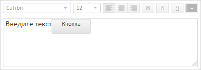

# TextEditor.insertNode

TextEditor.insertNode
-

# TextEditor.insertNode

## Синтаксис

insertNode(node: Object)

## Параметры

node. DOM-вершина, которую необходимо вставить в текстовую область.

## Описание

Метод insertNode вставляет DOM-вершину в текстовую область.

## Пример

Для выполнения примера предполагается наличие на странице компонента [TextEditor](../../Components/TextEditor/TextEditor.htm) с наименованием «textEditor» (см. описание [конструктора TextEditor](Constructor_TextEditor.htm)). Обработаем событие изменения активности текстового редактора, установим фокус на текстовый редактор, создадим кнопку и разместим её в текстовой области, сделаем текстовый редактор неактивным:

// Обработаем событие изменения активности редактора
textEditor.EnabledStateChanged.add(function (sender, args) {
    console.log("Инициировано событие EnabledStateChanged");
});
// Установим фокус на текстовый редактор
textEditor.focus();
// Создадим кнопку и разместим её в контейнере
var b = new PP.Ui.Button({
    Content: "Кнопка",
    Width: 80,
    Height: 30,
    ParentNode: document.getElementById("textEditorContainer")
})
// Разместим кнопку в текстовой области
textEditor.insertNode(b.getDomNode());
// Сделеам редактор неактивным
textEditor.setEnabled(false, true);

В результате выполнения примера в текстовой области была размещена кнопка. Текстовый редактор стал неактивным:

Также в консоли браузера было выведено сообщение о вызове события изменения активности редактора:

Инициировано событие EnabledStateChanged

См. также:

[TextEditor](TextEditor.htm)

		Справочная
		 система на версию 10.9
		 от 18/08/2025,
		 © ООО «ФОРСАЙТ»,
