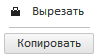

# ToolBar.Orientation

ToolBar.Orientation
-

# ToolBar.Orientation

## Синтаксис

Orientation: PP.[Orientation](dhtmlCommon.chm::/Enums/PP.Orientation.htm)

## Описание

Свойство Orientation устанавливает
 ориентацию для компонента [ToolBar](../../Components/ToolBar/ToolBar.htm).

## Комментарии

По умолчанию применяется ориентация по горизонтали.

## Пример

Для выполнения примера предполагается наличие компонента [ToolBar](../../Components/ToolBar/ToolBar.htm)
 с наименованием «toolBar» (см. «[Пример
 создания компонента ToolBar](../../Components/ToolBar/Example_ToolBar.htm)»).

До выполнения примера компонент имел следующий вид:

Изменим ориентацию на вертикальную:

toolBar.setOrientation(PP.Orientation.Vertical);

После выполнения примера компонент будет выглядеть следующим образом:

См. также:

[ToolBar](ToolBar.htm)

		Справочная
		 система на версию 10.9
		 от 18/08/2025,
		 © ООО «ФОРСАЙТ»,
