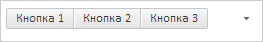
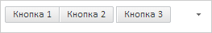
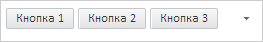

# ToolBar.removeItems

ToolBar.removeItems
-

# ToolBar.removeItems

## Синтаксис

removeItems(isDispose: Boolean);

## Параметры

isDispose. Определяет, удалять
 ли элементы полностью. Допустимые значения:

	- true.
	 Элементы панели инструментов будут полностью удалены (по умолчанию);

	- false.
	 Элементы панели инструментов будут скрыты.

## Описание

Метод removeItems удаляет все
 дочерние элементы панели инструментов.

## Пример

Для выполнения примера необходимо наличие на html-странице ссылок на
 файлы сценария PP.js и файл стилей PP.css, в теге <body> html-страницы
 элемента 
 с идентификатором «toolBar». В событии onload тега
 <body> необходимо указать вызов функции createToolBar(). Добавим
 на страницу панель инструментов с двумя группами кнопок и реализуем обработчик
 события [StateChanged](ToolBar.StateChanged.htm):

var toolBar;
function createToolBar() {
    // Создаем контейнер
    toolBar = new PP.Ui.ToolBar({
        // Устанавливаем родительский элемент
        ParentNode: "toolBar",
        // Устанавливаем размеры
        Width: 250,
        // Устанавливаем видимость кнопки меню со скрытыми кнопками
        ShowOverflowButton: true,
        // Убираем отступ между элементами группы
        IsSplitGroups: false,
        // Обработчик события изменения состояния элемента панели инструментов
        StateChanged: function (sender, args) {
            console.log("Изменилось состояние элемента с содержимым: " + args.Item.getContent());
        }
    });
    // Добавляем две группы кнопок
    toolBar.beginUpdate();
    for (var i = 0; i < 3; i++) {
        toolBar.addItem(new PP.Ui.ToolBarButton({ Content: "Кнопка " + (i+1), GroupName: "Группа1" }));
    }
    for (var i = 4; i < 7; i++) {
        toolBar.addItem(new PP.Ui.ToolBarButton({ Content: "Кнопка " + (i+1), GroupName: "Группа2" }));
    }
    toolBar.endUpdate();
}
В результате мы получим панель инструментов с двумя группами кнопок.
 Также панель инструментов будет содержать кнопку меню со скрытыми элементами.
 Вторая группа кнопок будет полностью скрыта:

При нажатии на кнопку в консоль будет выводиться сообщение об изменение
 состояния элемента панели инструментов:

Изменилось состояние кнопки с содержимым: Кнопка
 1

Удаляем третью кнопку из первой группы:

// Получаем третью кнопку из первой группы и удаляем ее из группы
var button = toolBar._Groups["Группа1"].pop();
// Обновляем первую группу кнопок
toolBar.refreshGroup("Группа1");
В результате третья кнопка не будет принадлежать первой группе:

Вставляем третью кнопку во вторую группу:

// Вставляем третью кнопку во вторую группу
toolBar._Groups["Группа2"].push(button);
// Обновляем все группы
toolBar.refreshGroups();
В результате третья кнопка будет принадлежать ко второй группе.

Устанавливаем отступ между элементами групп:

toolBar.setIsSplitGroups(true);
// Обновляем видимость элементов
toolBar.refreshItemsVisibility();
В результате все элементы будут разделены между собой:

Удаляем все элементы панели инструментов:

// Удаляем все элементы панели инструментов
toolBar.removeItems();
В результате панель управления не будет содержать элементов.

См. также:

[ToolBar](ToolBar.htm)

		Справочная
		 система на версию 10.9
		 от 18/08/2025,
		 © ООО «ФОРСАЙТ»,
