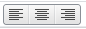

# ToolBarButton.GroupName

ToolBarButton.GroupName
-

# ToolBarButton.GroupName

## Синтаксис

GroupName: String

## Описание

Свойство GroupName устанавливает имя для группы переключателей.

## Комментарии

Установить для нескольких кнопок одно имя группы значит объединить их в одну группу. Группа переключателей отличается тем, что одновременно возможен выбор только одного члена группы.

## Пример добавления группы переключателей

Для выполнения примера необходимо наличие на html-странице компонента [ToolBar](../../Components/ToolBar/ToolBar.htm) с наименованием «toolBar» и компонента [ImageList](../../Components/ImageList/ImageList.htm), содержащего ссылку на файл с набором пиктограмм «ui-icons_222222_256x240.png» (см. «[Пример создания компонента ToolBar](../../Components/ToolBar/Example_ToolBar.htm)»).

//Создаем кнопки-переключатели - члены одной группы с наименованием «radioGroup»

    var lbtn = new PP.Ui.ToolBarButton({

        ToolTip: "Align left",

        RowIndex: 0,

        ColumnIndex: 12,

        Parent: toolBar,

        GroupName: "radioGroup"

    });

    var rbtn = new PP.Ui.ToolBarButton({

        ToolTip: "Align right",

        RowIndex: 0,

        ColumnIndex: 10,

        Parent: toolBar,

        GroupName: "radioGroup"

    });

    var cbtn = new PP.Ui.ToolBarButton({

        ToolTip: "Align center",

        RowIndex: 0,

        ColumnIndex: 11,

        Parent: toolBar,

        GroupName: "radioGroup"

    });

//Добавляем на панель кнопки-переключатели:

    toolBar.addItem(lbtn);

    toolBar.addItem(cbtn);

    toolBar.addItem(rbtn);

После выполнения примера на панели инструментов будут размещены кнопки-переключатели:

Из переключателей, объединенных в группу, может быть выбран только один:

См. также:

[ToolBarButton](ToolBarButton.htm)

		Справочная
		 система на версию 10.9
		 от 18/08/2025,
		 © ООО «ФОРСАЙТ»,
