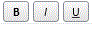
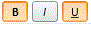

# ToolBarButton.IsToggle

ToolBarButton.IsToggle
-

# ToolBarButton.IsToggle

## Синтаксис

IsToggle: Boolean

## Описание

Свойство IsToggle определяет, является ли кнопка флажком.

## Комментарии

Если установлено значение true, кнопка является флажком, то есть при ее нажатии, выделение сохраняется. По умолчанию установлено значение false, то есть при нажатии на кнопку выделение не сохраняется.

## Пример

Для выполнения примера необходимо наличие на html-странице компонента [ToolBar](../../Components/ToolBar/ToolBar.htm) с наименованием «toolBar» и компонента [ImageList](../../Components/ImageList/ImageList.htm), содержащего ссылку на файл с набором пиктограмм «ui-icons_222222_256x240.png» (см. «[Пример создания компонента ToolBar](../../Components/ToolBar/Example_ToolBar.htm)»).

//Создаем кнопки-флажки:

        var ubtn = new PP.Ui.ToolBarButton({

            ToolTip: "Underlined",

            RowIndex: 0,

            ColumnIndex: 13,

            Parent: toolBar,

            IsToggle: true

        });

        var bbtn = new PP.Ui.ToolBarButton({

            ToolTip: "Bold",

            RowIndex: 0,

            ColumnIndex: 14,

            Parent: toolBar,

            IsToggle: true

        });

        var ibtn = new PP.Ui.ToolBarButton({

            ToolTip: "Italic",

            RowIndex: 0,

            ColumnIndex: 15,

            Parent: toolBar,

            IsToggle: true

        });

//Добавляем кнопки-флажки:

       toolBar.addItem(bbtn);

       toolBar.addItem(ibtn);

       toolBar.addItem(ubtn);

После выполнения примера на панели инструментов будут размещены кнопки-флажки:

Несколько кнопок можно выделить одновременно:

См. также:

[ToolBarButton](ToolBarButton.htm)

		Справочная
		 система на версию 10.9
		 от 18/08/2025,
		 © ООО «ФОРСАЙТ»,
