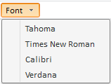

# ToolBarButton.Menu

ToolBarButton.Menu
-

# ToolBarButton.Menu

## Синтаксис

Menu: PP.Ui.[Menu](../Menu/Menu.htm)

## Описание

Свойство Menu устанавливает дочернее меню компонента.

## Пример

Для выполнения примера необходимо наличие на html-странице компонента [ToolBar](../../Components/ToolBar/ToolBar.htm) с наименованием «toolBar» и компонента [ImageList](../../Components/ImageList/ImageList.htm), содержащего ссылку на файл с набором пиктограмм «ui-icons_222222_256x240.png» (см. «[Пример создания компонента ToolBar](../../Components/ToolBar/Example_ToolBar.htm)»).

//Создаем компонент Menu - дочернее меню для кнопки

        var menu = new PP.Ui.Menu();

        menu.addItem(new PP.Ui.MenuItem({ Content: "Tahoma"}));

        menu.addItem(new PP.Ui.MenuItem({ Content: "Times New Roman"}));

        menu.addItem(new PP.Ui.MenuItem({ Content: "Calibri"}));

        menu.addItem(new PP.Ui.MenuItem({ Content: "Verdana"}));

//Создаем кнопку, содержащую дочернее меню

        var fontsButton = new PP.Ui.ToolBarButton({

            Content: "Font",

            ToolTip: "Select font",

            IsFlat: false,

            Parent: toolBar,

            Menu: menu

        });

//Добавляем кнопку с меню:

        toolBar.addItem(fontsButton);

После выполнения примера на html-странице будет размещена кнопка с раскрывающимся меню:

См. также:

[ToolBarButton](ToolBarButton.htm)

		Справочная
		 система на версию 10.9
		 от 18/08/2025,
		 © ООО «ФОРСАЙТ»,
