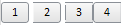

# ToolBarButton.setRoundedCorners

ToolBarButton.setRoundedCorners
-

# ToolBarButton.setRoundedCorners

## Синтаксис

setRoundedCorners(value: PP.Ui.ToolBarButton.[RoundedCorners](../../Enums/RoundedCorners.htm));

## Параметры

value. Определяет вариант скругления углов. Элемент перечисления [RoundedCorners](../../Enums/RoundedCorners.htm).

## Описание

Метод setRoundedCorners устанавливает вариант скругления углов для кнопки.

## Комментарии

По умолчанию для параметра value установлено значение All, то есть скругляются все углы.

## Пример

Для выполнения примера необходимо наличие на html-странице компонента [ToolBar](../../Components/ToolBar/ToolBar.htm) с наименованием «toolBar» (см. «[Пример создания компонента ToolBar](../../Components/ToolBar/Example_ToolBar.htm)»).

//Добавим на панель инструментов 4 кнопки:

    toolBar.addItem(new PP.Ui.ToolBarButton({ Content: "1"

}));

    toolBar.addItem(new PP.Ui.ToolBarButton({ Content: "2"

}));

    toolBar.addItem(new PP.Ui.ToolBarButton({ Content: "3"

}));

    toolBar.addItem(new PP.Ui.ToolBarButton({ Content: "4"

}));

//Для каждой кнопки определим вариант скругления углов:

toolBar.getItem(0).setRoundedCorners("All");

toolBar.getItem(1).setRoundedCorners("Right");

toolBar.getItem(2).setRoundedCorners("None");

toolBar.getItem(3).setRoundedCorners("Left");

После выполнения примера на панели инструментов будут размещены 4 кнопки с разными вариантами скругления углов:

См. также:

[ToolBarButton](ToolBarButton.htm)

		Справочная
		 система на версию 10.9
		 от 18/08/2025,
		 © ООО «ФОРСАЙТ»,
