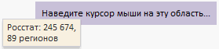

# Конструктор ToolTip

Конструктор ToolTip
-

# Конструктор ToolTip

## Синтаксис

PP.Ui.ToolTip(settings);

## Параметры

settings. JSON-объект
 со значениями свойств компонента.

## Описание

Конструктор ToolTip создает
 экземпляр класса [ToolTip](ToolTip.htm).

## Пример

Для выполнения примера в теге HEAD html-страницы должны быть подключены
 ссылки на библиотеку компонентов PP.js и таблицы визуальных стилей PP.css.
 Разместим на странице текстовую область, при наведении курсора на которую
 будет всплывать подсказка:

<table style="height: 300px">

   <tr>

     <td style="vertical-align:
 top;">

        
Наведите
 курсор мыши на эту область...

         

      </td>

   </tr>

</table>

После выполнения примера на html-странице будет размещена текстовая
 область, при наведении курсора на которую будет всплывать подсказка:

При нажатии на текстовую область подсказка будет скрыта.

См. также:

[ToolTip](ToolTip.htm)

		Справочная
		 система на версию 10.9
		 от 18/08/2025,
		 © ООО «ФОРСАЙТ»,
