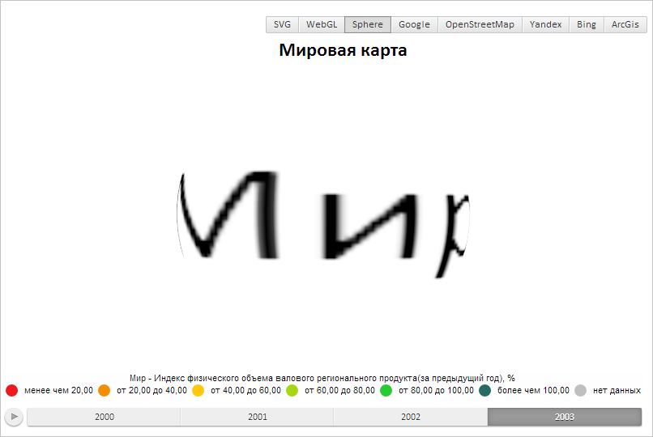

# WebGLControl.createTextTexture

WebGLControl.createTextTexture
-

# WebGLControl.createTextTexture

## Синтаксис

createTextTexture(name: String, text: String, font:
 PP.[Font](dhtmlCommon.chm::/Classes/PP/Font/Font.htm),
 background: PP.[Color](dhtmlCommon.chm::/Classes/PP/Color/Color.htm));

## Параметры

name. Идентификатор текстуры;

text. Добавляемый текст;

font. Шрифт текста;

background. Цвет фона.

## Описание

Метод createTextTexture создает
 текстуру с текстом.

## Пример

Для выполнения примера предполагается наличие на странице компонента
 [MapChart](dhtmlMapChart.chm::/Components/MapChart/MapChart.htm)
 c наименованием «map» (см. «[Пример
 создания компонента MapChart](dhtmlMapChart.chm::/Components/MapChart/MapChart_Example.htm)»). Необходимо открыть
 сферическую карту. Создаем текстуру с текстом:

// Получаем элемент управления сферической карты
var control = map.getGLControl();
// Создаем текстуру с текстом
control.createTextTexture("../../build/img/Earth.png", "Мир",new PP.Font({
    Size: 9,
    Family: PP.Font.Family.Calibri
}));
// Очищаем карту
control.clear();
// Отрисовываем только поверхность шара с текстурой
control.renderMesh(control.getMesh(0));
В результате будет отрисована текстура с текстом:

См. также:

[WebGLControl](WebGLControl.htm)

		Справочная
		 система на версию 10.9
		 от 18/08/2025,
		 © ООО «ФОРСАЙТ»,
