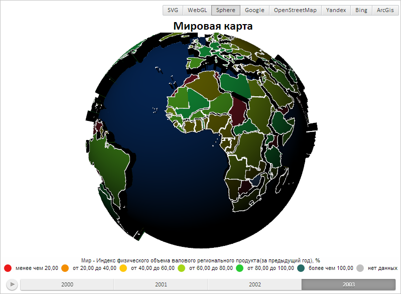

# WebGLControl.renderMesh

WebGLControl.renderMesh
-

# WebGLControl.renderMesh

## Синтаксис

renderMesh(mesh_id: String || PP.Ui.WebGLMesh);

## Параметры

mesh_id. Объект или его идентификатор.

## Описание

Метод renderMesh отрисовывает
 поверхность многогранного объекта.

## Пример

Для выполнения примера предполагается наличие на странице компонента
 [MapChart](dhtmlMapChart.chm::/Components/MapChart/MapChart.htm)
 c наименованием «map» (см. «[Пример
 создания компонента MapChart](dhtmlMapChart.chm::/Components/MapChart/MapChart_Example.htm)»). Необходимо открыть
 сферическую карту. Изменим прямой и окружающий свет сферической карты:

// Получаем элемент управления сферической карты
var control = map.getGLControl();
// Очищаем область отрисовки
control.clear();
// Устанавливаем новый прямой свет
control.setDirectLight("#60A1FA");
// Устанавливаем новый окружающий цвет
control.setAmbientLight("#000000");
// Обновляем всю поверхность карты
for (var i=0; i<327; i++) {
    control.renderMesh(control.getMesh(i));
}
В результате карта будет иметь следующий вид:

См. также:

[WebGLControl](WebGLControl.htm)

		Справочная
		 система на версию 10.9
		 от 18/08/2025,
		 © ООО «ФОРСАЙТ»,
