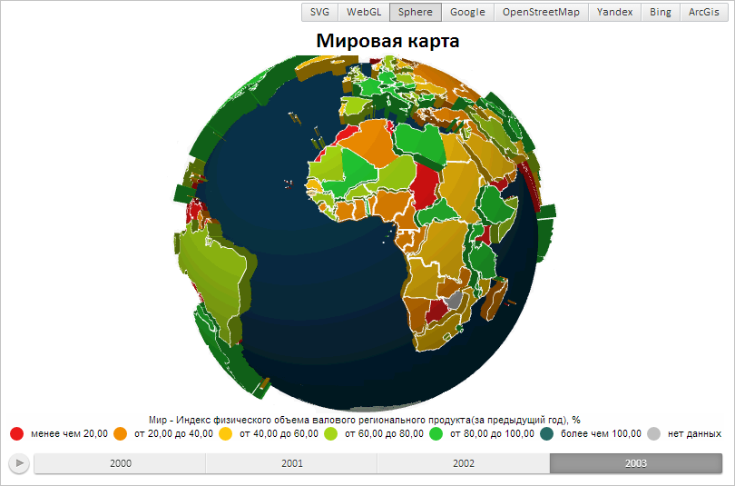

# WebGLControl.setDepthTestEnabled

WebGLControl.setDepthTestEnabled
-

# WebGLControl.setDepthTestEnabled

## Синтаксис

setDepthTestEnabled(enable: Boolean);

## Параметры

enable. Состояние теста глубины.
 Если для параметра установлено значение true,
 то будет запущен тест глубины.

## Описание

Метод setDepthTestEnabled включает
 или выключает тест глубины.

## Комментарии

Тест глубины проверяет перекрытие одних плоскостей другими и строит
 объект согласно этим перекрытиям.

## Пример

Для выполнения примера предполагается наличие на странице компонента
 [MapChart](dhtmlMapChart.chm::/Components/MapChart/MapChart.htm)
 c наименованием «map» (см. «[Пример
 создания компонента MapChart](dhtmlMapChart.chm::/Components/MapChart/MapChart_Example.htm)»). Необходимо открыть сферическую карту.
 Выключаем тест глубины:

// Получаем элемент управления сферической карты
var control = map.getGLControl();
// Выключаем тест глубины
control.setDepthTestEnabled(false);
В результате карта будет иметь следующий вид:

См. также:

[WebGLControl](WebGLControl.htm)

		Справочная
		 система на версию 10.9
		 от 18/08/2025,
		 © ООО «ФОРСАЙТ»,
