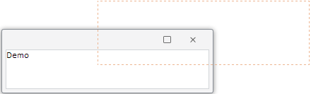

# Window.DragContentView

Window.DragContentView
-

# Window.DragContentView

## Синтаксис

DragContentView: Boolean

## Описание

Свойство DragContentView определяет, отображается ли окно при перемещении.

## Комментарии

По умолчанию установлено значение true: при перемещении окно отображается полностью. Если установлено значение false - при перемещении окна перемещаются только его границы, например:

Свойство актуально, только если для свойства [Window.EnableMove](Window.EnableMove.htm) установлено значение true.

## Пример

Для выполнения примера необходимо наличие на html-странице компонента [Window](../../Components/Window/Window.htm) с наименованием «win» (см. «[Пример создания компонента Window](../../Components/Window/Example_Window.htm)»). Установим возможность перемещать окно и определим, что при перемещении окна будут перемещаться только его границы:

win.setEnableMove(true);
win.setDragContentView(false);

После выполнения примера для окна была включена возможность перемещения. При перемещении окна перемещаются только его границы (см. рисунок в разделе «Комменатрии»).

См. также:

[Window](Window.htm)

		Справочная
		 система на версию 10.9
		 от 18/08/2025,
		 © ООО «ФОРСАЙТ»,
