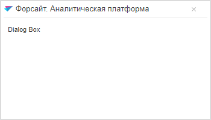

# Window.showDialog

Window.showDialog
-

# Window.showDialog

## Синтаксис

showDialog (left: Number, top: Number, parentWindow:
 Boolean)

## Параметры

left.. Расстояние от левого
 края в пикселях;

top. Расстояние от верхнего
 края в пикселях;

parentWindow. Родительское
 окно.

## Описание

Метод showDialog отображает
 окно.

## Комментарии

Окно предназначено для вывода информации и (или) получения
 ответа от пользователя.

Если параметры метода не заданы, то окно будет расположено по центру.

## Пример

Для выполнения примера подключите библиотеку компонентов PP.js и таблицы
 визуальных стилей PP.css. Необходимо наличие файла с наименованием «icon.png».
 Далее приведен javascript-код для создания компонента [Window](../../Components/Window/Window.htm),
 который отображается в виде окна.

После выполнения примера на html-странице будет размещено окно, имеющее следующий вид:

Окно расположено по центру, поскольку не заданы параметры метода showDialog.

См. также:

[Window](Window.htm)

		Справочная
		 система на версию 10.9
		 от 18/08/2025,
		 © ООО «ФОРСАЙТ»,
