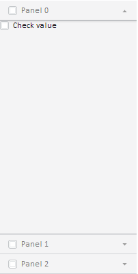

# Конструктор Master

Конструктор Master
-

# Конструктор Master

## Синтаксис

PP.Ui.Master(settings);

## Параметры

settings. JSON-объект со значениями свойств компонента.

## Описание

Конструктор Master создает экземпляр класса [Master](Master.htm).

## Пример

Для выполнения примера добавьте ссылки на библиотеку PP.js и визуальные стили PP.css. В теге SCRIPT добавьте следующий код:

var master = new PP.Ui.Master( //создаем экземпляр класса PP.Ui.Master
{
   ParentNode: document.body
});
//добавляем вкладки
master.addNavItem(new PP.Ui.NavigationItem());
master.addNavItem(new PP.Ui.NavigationItem());
master.addNavItem(new PP.Ui.NavigationItem(), 0);
//в первую вкладку добавляем элемент управления
master.getItem(0).setContent(new PP.Ui.CheckBox(
{
   Content: "Check value"
}));
//определяем заголовок для всех вкладок
for (var i = 0; i < master.getItems().length; i++)
master.getItems()[i].setTitle("Panel " + i);
//раскрываем первую вкладку с использованием анимации
master.expandFirstItem(true);

После выполнения примера на странице будет размещен мастер с тремя вкладками. Заголовки вкладок: «Panel + <индекс вкладки>». При загрузке страницы первая вкладка будет развернута. При разворачивании вкладки будет применяться анимация. На первой вкладке мастера добавлен [флажок](../CheckBox/CheckBox.htm) «Check value»:

См. также:

[Master](Master.htm)

		Справочная
		 система на версию 10.9
		 от 18/08/2025,
		 © ООО «ФОРСАЙТ»,
