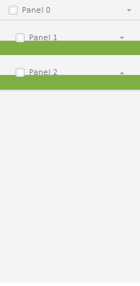

# Master.addClassToTitles

Master.addClassToTitles
-

# Master.addClassToTitles

## Синтаксис

addClassToTitles (className);

## Параметры

className. Имя дополнительного класса стиля.

## Описание

Метод addClassToTitles устанавливает дополнительный класс стиля заголовку всех вкладок мастера, за исключением первой.

## Пример

Для выполнения примера предполагается наличие на странице компонента [Master](Master.htm) с наименованием «master» (см. «[Конструктор Master](Constructor_Master.htm)»). Установим дополнительный класс стиля для всех вкладок мастера, за исключением первой.

В теге HEAD добавьте класс стиля:

Применим этот стиль к заголовкам всех вкладок мастера кроме первой:

master.addClassToTitles("titleStyle");

После выполнения примера компонент будет иметь следующий вид:

См. также:

[Master](Master.htm)

		Справочная
		 система на версию 10.9
		 от 18/08/2025,
		 © ООО «ФОРСАЙТ»,
